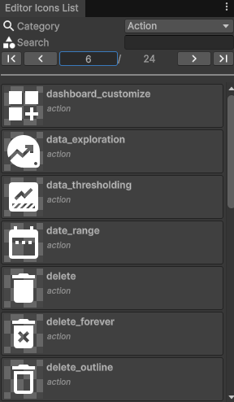

# Getting Started

As of now, this package is mostly meant to allow using [Material Icons](https://fonts.google.com/icons?icon.set=Material+Icons&icon.style=Rounded) for our custom editors.

## Visualize all available icons

If you just need to search for icons, we recommend using the [Material Icons website](https://fonts.google.com/icons?icon.set=Material+Icons), which has better search filters.

If you want to see the available icons as displayed in the editor, go to `Tools > Sideways Experiments > Editor Icons List`, and navigate through pages. Categories are based on the folders from the [Material Icons GitHub project](https://github.com/google/material-design-icons/tree/master/png).

## Display an icon in an editor view

- To get the icon texture alone, use the [`GetIcon()`](./api.md) function
- To get a [`GUIContent`](https://docs.unity3d.com/ScriptReference/GUIContent.html) value with a [Material Icon](https://fonts.google.com/icons?icon.set=Material+Icons) as image, use the [`IconContent()`](./api.md) function
- To draw a button with a [Material Icon](https://fonts.google.com/icons?icon.set=Material+Icons), use the [`IconButton()`](./api.md) function